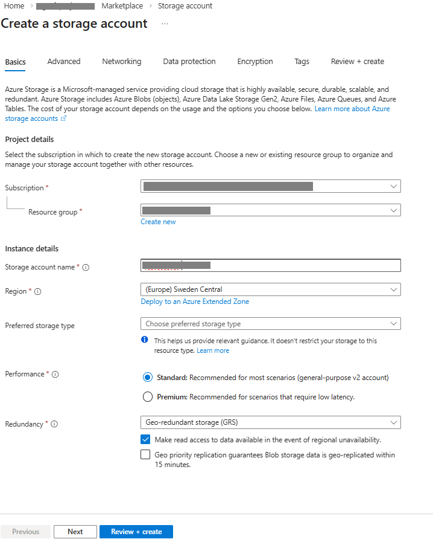
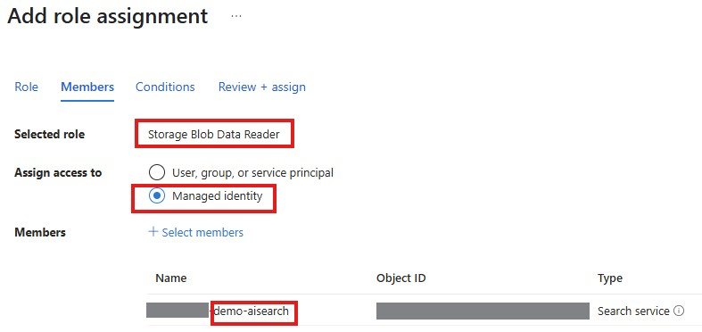
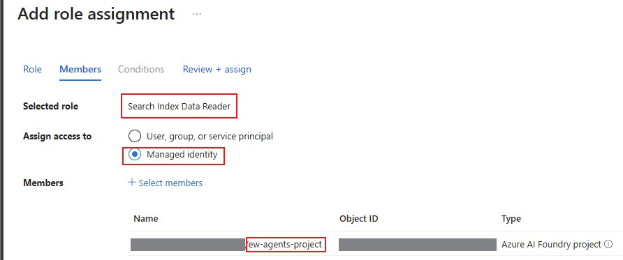
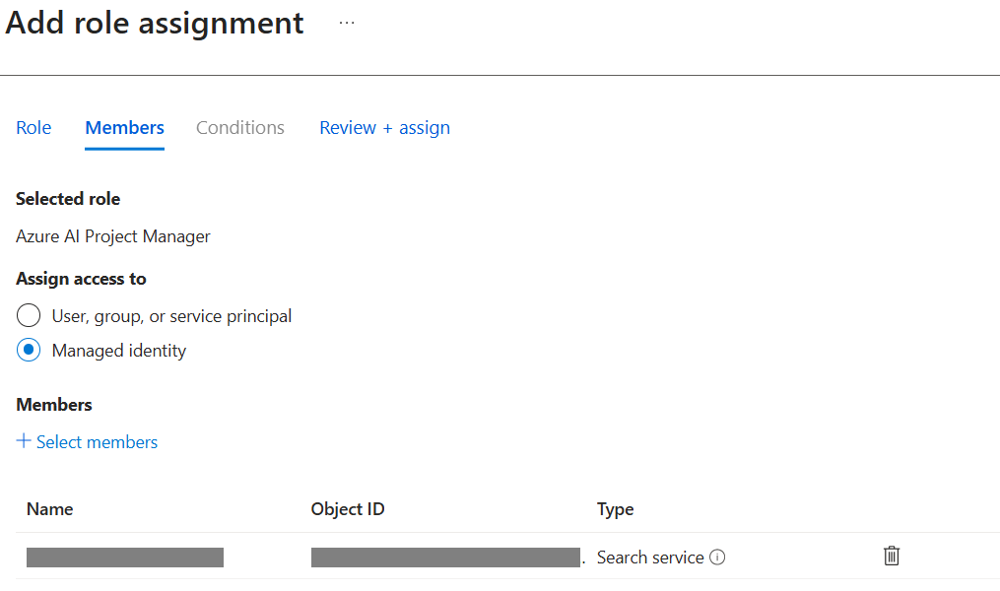
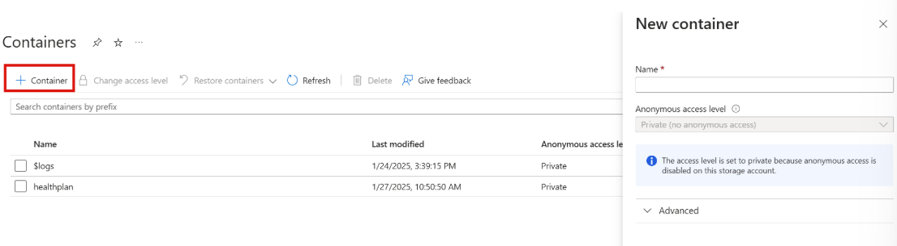
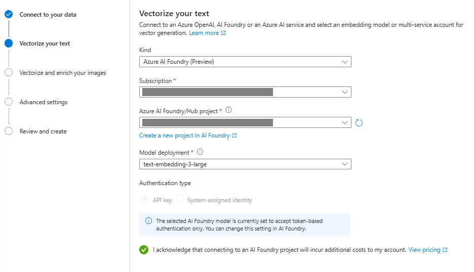

## Azure AI Search Index: Step-by-step Guide

In this tutorial, we’ll focus on creating an index in Azure AI Search and then integrate it as a function tool within a simple agent built with Microsoft Agent Framework. This setup will allow our agent to retrieve relevant information from the search index and respond intelligently in a chat scenario.

#### Introduction to Azure AI Search

**Azure AI Search** is a fully managed search-as-a-service that lets you add sophisticated search capabilities to your apps without having to manage the whole search infrastructure.

- **Core capabilities:** Azure AI Search indexes your content (documents, databases, files, etc.) and provides fast, relevant search results with features like full-text search, filtering, faceting, autocomplete, and semantic search. The "AI" part comes from its integration with cognitive services for things like Optical Character Recognition (OCR), key phrase extraction, entity recognition, and language detection during indexing.
- **Data sources:** You can pull data from various sources like Azure Blob Storage, Azure SQL Database, Cosmos DB, or push data directly via REST APIs. It supports many file formats including PDFs, Office documents, HTML, JSON, and plain text.

Beyond basic keyword search, Azure AI Search offers semantic search (understanding meaning and context), vector search for similarity matching, hybrid search combining multiple approaches, and AI enrichment to extract insights from unstructured content. You can also customize ranking, add synonyms, and support multiple languages.

#### Prerequisites

Before proceeding with this guide, ensure you have:

- **Completed the Microsoft Foundry project creation** by following the steps in the README
- **Identified your resource group in Azure Portal**: You can find the resource group name under **"Project details"** on your project's **"Overview"** page in Foundry.

**Note**: At this point, your resource group in Azure Portal contains only Foundry resources. In the following steps, we will create an Azure AI Search Service within the same resource group

#### Step 1: Create an Azure AI Search service

1. Navigate to our project's resource group in the Azure portal and create a new Azure AI Search service resource:
	Create -> Search for "Azure AI Search"
	1. It is recommended to create the search service in the same region as your AI project
	2. Select 'Standard' tier, which is required for these labs
	
    

2. Navigate to your search service once it is created. Under Settings -> Keys, ensure 'Both' is selected for API access control. Click 'Save'.

3. Navigate to Settings -> Identity -> Turn on system-assigned identity -> click 'Save'.

4. In Foundry Portal, deploy an embedding model the same way we initially set up the gpt-4o chat model deployment:
	Select `text-embedding-3-large` and deploy it. This will be used later to create the vector embeddings for our documents.

#### Step 2: Create a Storage Account

We need to create a storage account and a storage container within it which will store our health plan documents. This is where our Azure AI Search service will retrieve our health plan documents from:

Create -> Search for "Storage Account" -> Click "Create"

#### Step 3: Required permissions for the lab

##### Managed-identity permissions:

The next steps are needed for the AI search resource to be able to vectorize the input documents:

1. Navigate to the created storage account's **Access Control (IAM)** section. Select 'Add'->'Add role assignment'. **Assign the 'Storage Blob Data Reader role' to the search service identity**, as shown here:

    

2. Navigate to your **Azure AI Search resource** that was created above. Assign two roles to your project's managed identity: the **'Search Index Data Reader'** role and the **'Search Service Contributor'** role:

    

    

3. Navigate to your **Foundry** resource. Select Access control (IAM) -> Add Role assignment -> Select **Azure AI Project Manager** role -> Next -> Under **Members**, select **Managed identity**, and then select your subscription and the managed identity of your search service:

    

### User permissions:

**If you have contributor or higher permissions on a resource group, you inherit these user permissions and DO NOT need to add the below role assignments**, you can proceed to the next step. Otherwise, if you are a user, check to ensure the below role assignments are added for you.

TIP: if you are working on project teams and need to assign permissions to multiple users, you can add these permissions faster by creating a Entra ID security group (so you do not have to add users one-by-one) and by running Azure CLI scripts in Azure Cloud Shell.

1. At a minimum, users running these labs should have a **Reader role assigned on the Azure Subscription level**. In the Azure Portal, navigate to the Azure Subscription in which your resource group lives. On the left pane, select Access control > Role assignments. Filter 'Scope' to 'This resource'. Review user account permissions. If this is not asssigned, add this role assignment to the user.

2. **Each user needs to be granted the 'Cognitive Services OpenAI Contributor' role on the Azure AI Foundry resource**. To do this, in the Azure Portal, navigate to the Azure AI Foundry resource, select Access control > Add+ Role assignment > select Cognitive Services OpenAI Contributor role > next select the user(s) > create role assignment.

3. **Each user needs to be granted the 'Azure AI Project Manager' role on the Azure AI Foundry resource**. To do this, in the Azure Portal, navigate to the Azure AI Foundry resource, select Access control > Add+ Role assignment > select Azure AI Project Manager role > next select the user(s) > create role assignment. 

4. **Each user needs to be granted the 'Azure AI Project Manager' role in their resprective Azure AI Foundry project**. To do this, in the Azure Portal, navigate to the appropriate Foundry project, select Access control > Add+ Role assignment > select Azure AI Project Manager role > next select the user(s) > create role assignment. Repeat this process, as necessary, for all of the Foundry projects within your Foundry Resource.

5. **Each user needs to be granted the 'Storage Blob Data Contributor' role on the Storage Account**. To do this, add another role assignment > select Storage Blob Data Contributor role > next select the user(s) > create role assignment.

6. **Each user needs to be granted the 'Search Service Contributor' role on the Azure AI Search resource**. To do this, add another role assignment > select Search Service Contributor role > next select the user(s) > create role assignment.

### Part 2: Create the Azure AI Search Index

We'll start the lab by creating an Azure AI Search index in our search service, which will contain vectorized representations of our documents. The steps shown below to create the AI Search index are from the official [Microsoft Documentation](https://learn.microsoft.com/en-us/azure/search/search-get-started-portal-import-vectors?tabs=sample-data-storage%2Cmodel-aoai%2Cconnect-data-storage)

#### Step 1
Inspect the documents in the 'data/index1' folder in the root of the '03-rag' folder. These will be stored in our Azure AI Search index.

#### Step 2
Next, we'll upload the documents to Azure Blob Storage, which Azure AI search connects to.
1. Navigate to the Storage Account you've just created. 
2. Expand "Data Storage" in the side menu and click on "Containers". 
3. Create a new container named: [your-initials] + "infodocs" (Example: 'kkinfodocs'). If you are working in a project team, everyone will be working in the same Storage Account, so we want to make sure our Blob Storage Container names are unique!

    
4. Click on the new container and upload the documents in the 'data' folder.

    
    
*Note*: if you get a warning about not having the permissions to list the data using your user account, go to 'Access Control (IAM)' and assign the 'Storage Blob Data Owner' role to your user

#### Step 3
We need an embedding model in order to convert our documents into vectors that will be stored in Azure AI Search. For that we will use the Azure AI Foundry model we already deployed previously.

For this to work, make sure you added the "Azure AI Project Manager" permission in Step 3.3

#### Step 4
Now we're ready to vectorize our documents.
1. Go to your Azure AI Search Service
2. On the **Overview page**, select **Import data (new)**.
3. Select **Azure Blob Storage** as your data source.
4. On the next page, select **RAG**.
5. On the next page **configure your Azure blob storage** by specifying your subscription, storage account, and the container that contains your healthplan documents 
6. Make sure **Authenticate using managed idenity is checked** and the **Managed identity type** is set to **System-assigned**.

    

5. On the **Vectorize your text** page, select **Azure AI Foundry (Preview)** for **Kind**, select your subscription, and select the name of your Azure AI Foundry project.

6. For the **Model deployment** select `text-embedding-3-large`. 

7. Select the box next to the acknowledgement.

    

8. You can hit **Next** for the next two pages. When you get to the **Review and create** page, set **Objects name prefix** to **[your-blob-container-name]-index** (Example: 'kkhealthplan-index'). Click **Create**. This will start the document indexing process which will vectorize your documents and create an index. 

    

*Note*: it may take a few minutes for you index to fully populate with your document chunks. Wait until the process is complete.
    

### TODO - Overview of what happened in the background

In this setup, we deployed two models in Azure AI Foundry

GPT-4o - Chat/completion model for powering your AI agents
Text embedding model - Converts documents into vector representations for semantic search

In Azure, we created the necessary infrastructure within your resource group:

Foundry resource - The underlying AI services hub that hosts all model deployments and provides API endpoints
Foundry project resource - The project-level workspace for managing agents, configurations, and orchestrating AI workflows
Azure AI Search service - Provides indexing, vector storage, and fast semantic search capabilities
Storage account - Stores your source documents and data to be indexed

This architecture enables you to create AI agents that can perform Retrieval-Augmented Generation (RAG) by searching through your indexed knowledge base. The embedding model vectorizes your documents, the search service indexes and retrieves relevant information, and the GPT-4o model generates intelligent responses based on that context. The Foundry resource provides the AI capabilities while the Foundry project resource organizes your work, with all components working together for streamlined deployment and maintenance.

The setup is done! Now you can proceed - go to the `03.1-rag_agent.ipynb` notebook to implement your first Search Agent.
